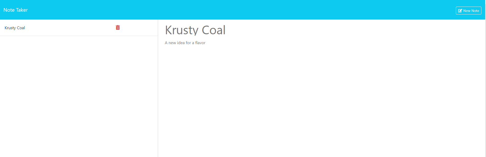

# Note-Taker 
## Table of Contents
1. [Description](#description)
2. [Installation](#installation)
3. [Usage](#usage)
4. [License](#license)
5. [Contributing](#contributing)
6. [Tests](#tests)
7. [Questions](#questions) 
## Description
An app which lets you write and save notes. It uses express.js to handle get and post requests from the user.
 
[A link to the deployed app](https://note-taker-l4n2.onrender.com)

## Installation
N/A
## Usage
Access the app at https://note-taker-l4n2.onrender.com Navigate to the app by pressing the Get Started button on the homepage. Entering text into the title and text fields will allow you to enter notes. Press the red garbage can icon to delete a note.
## License

Click the above badge to see the license.
## Contributing
N/A
## Tests
N/A
## Questions
Github: https://github.com/akaufmanfrey 

 